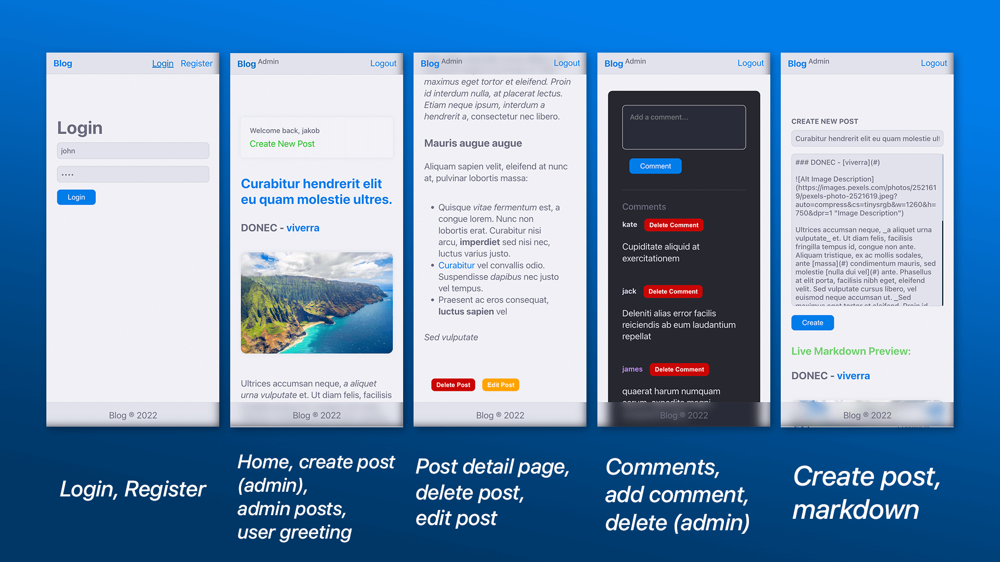

# Blog MERN

A blog website where the admin can create blogs with markdown, edit, delete and publish them. The user can view the blogs and comment on them

> Note: This is the production version of blog-mern. A MERN blog app from an assignment project from [the Odin Project](https://www.theodinproject.com/lessons/nodejs-blog-api) It is part of the full stack API section of their course.

## Live Demo

> **TEST USER:** username: `john`, password: `1234`

[https://blog-mern-client.onrender.com/](https://blog-mern-client.onrender.com/)

#### Screenshot

## Test the app locally on your machine

- go to [blog-mern-local](https://github.com/emanuelefavero/blog-mern-local) repo and follow the instructions
